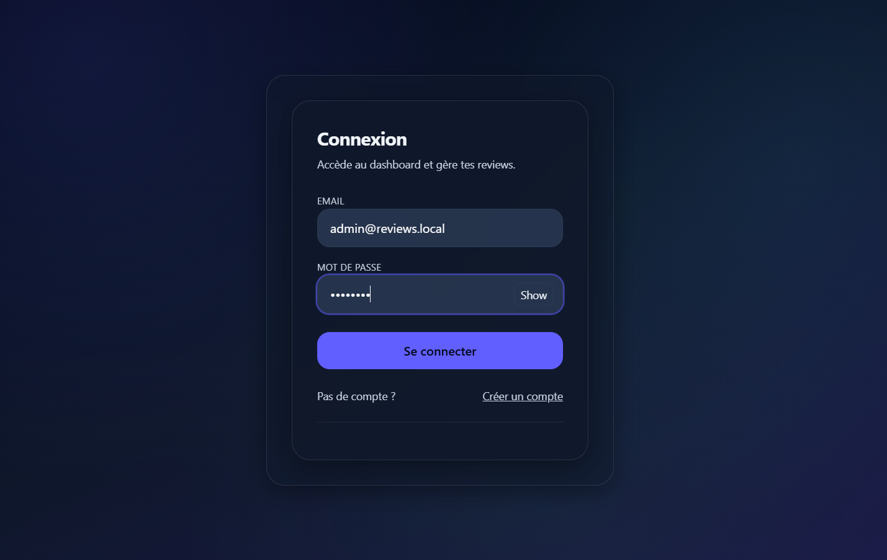
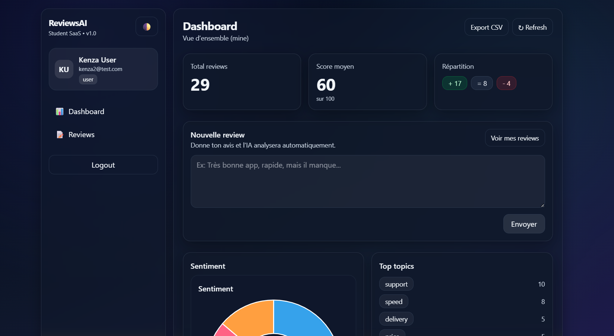
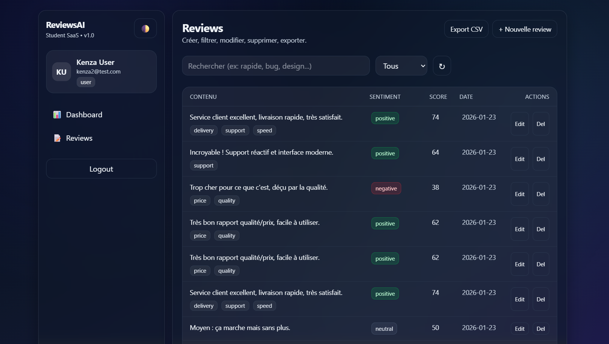
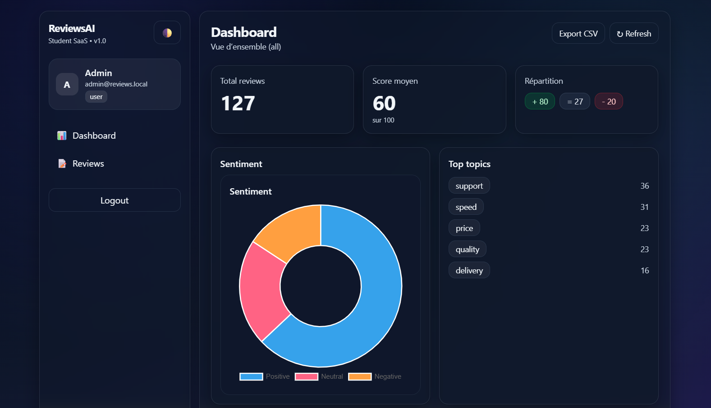

# ReviewsAI Platform — Full-Stack SaaS (Laravel + Vue)

Plateforme SaaS d’analyse d’avis clients : authentification sécurisée, rôles (admin/user), dashboard analytics, gestion des reviews, export CSV.

## Aperçu (screenshots)
> Les captures sont dans `docs/screenshots/`.

- Login  
  

- Dashboard User (scope: mine + ajout review)  
  

- Gestion des Reviews (CRUD + recherche + filtres + pagination)  
  

- Dashboard Admin (scope: all)  
  

- Admin Panel — Utilisateurs (pagination + recherche)  
  

## Fonctionnalités principales

### Auth & Sécurité
- Inscription / connexion
- Authentification par token (Laravel Sanctum)
- Routes protégées
- Rôles **admin** / **user**
- Accès admin interdit aux users (403) + guard frontend

### Reviews (User)
- Création / modification / suppression
- Analyse automatique (sentiment / score / topics selon backend)
- Recherche texte + filtre par sentiment
- Pagination
- Modals + UX states (loading/empty)

### Dashboards (User vs Admin)
- **User** : données personnelles (`scope: mine`) + formulaire “Nouvelle review”
- **Admin** : vue globale (`scope: all`) + statistiques globales

### Admin Panel
- Liste des utilisateurs (pagination + recherche)
- Visible uniquement pour les admins

### Export CSV
- Export des reviews en CSV
- Téléchargement sécurisé (token requis)

## Stack Technique
- **Backend** : Laravel API + SQLite + Sanctum
- **Frontend** : Vue 3 + Vite + Tailwind CSS + Axios + Vue Router
- **Qualité** : séparation API / SPA, guards, middleware admin, seed de démo

---

# Installation & Lancement (Local)

## Prérequis
- PHP + Composer
- Node.js + npm
- SQLite (inclus via fichier)

## Backend (Laravel)
```bash
cd backend
composer install
cp .env.example .env
php artisan key:generate
php artisan migrate:fresh --seed --seeder=DemoDataSeeder
php artisan serve
