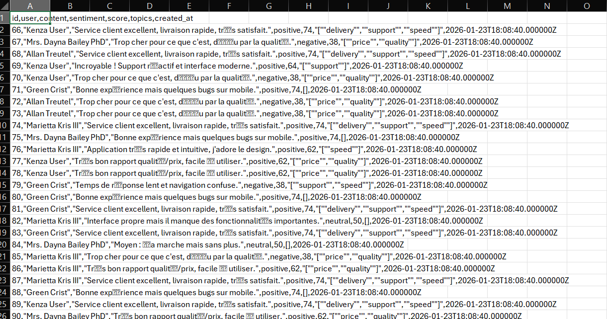

# ReviewsAI Platform — Full-Stack SaaS (Laravel + Vue)

Plateforme SaaS d’analyse d’avis clients : authentification sécurisée, rôles (admin/user), dashboards analytics, gestion des reviews et export CSV.

---

## Aperçu (screenshots)
> Les captures sont disponibles dans `docs/screenshots/`.

- Login  
  

- Dashboard User (scope: mine + ajout review)  
  

- Gestion des Reviews (CRUD + recherche + filtres + pagination)  
  

- Dashboard Admin (scope: all)  
  

- Telechargement Csv — Utilisateurs 
  

---

## Fonctionnalités principales

### Authentification & Sécurité
- Inscription / Connexion
- Authentification par token (Laravel Sanctum)
- Routes API protégées
- Rôles **admin** / **user**
- Accès admin interdit aux users (403)
- Guards frontend + middleware backend

### Reviews (User)
- Création / modification / suppression
- Analyse automatique (sentiment / score / topics)
- Recherche textuelle
- Filtres par sentiment
- Pagination
- UX states (loading / empty)

### Dashboards (User vs Admin)
- **User** : données personnelles (`scope: mine`) + création de review
- **Admin** : vue globale (`scope: all`) + statistiques agrégées

### Admin Panel
- Liste des utilisateurs
- Pagination + recherche
- Accès réservé aux admins

### Export CSV
- Export sécurisé des reviews
- Téléchargement via token

---

## Stack Technique
- **Backend** : Laravel API, SQLite, Sanctum
- **Frontend** : Vue 3, Vite, Tailwind CSS, Axios, Vue Router
- **Architecture** : API REST + SPA
- **Qualité** : séparation claire frontend/backend, middleware admin, seed de démo

---

## Installation & Lancement (Local)

### Prérequis
- PHP + Composer
- Node.js + npm
- SQLite (via fichier local)

### Backend (Laravel)
```bash
cd backend
composer install
cp .env.example .env
php artisan key:generate
php artisan migrate:fresh --seed
php artisan serve
